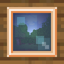
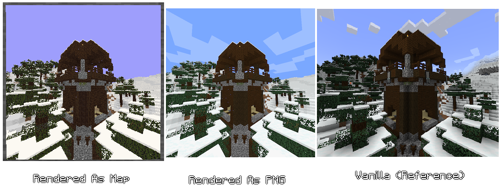

# Camera Obscura



Capture fotos do seu mundo ou servidor!  
Tudo é renderizado no servidor usando raytracing simples.



---

## Item

O mod adiciona um item **Câmera**. Para clientes, ele se comporta como uma luneta normal, mas possui nome personalizado e consome papel conforme definido nas configurações.

> **Nota:** Ainda não há receita para o item. Algumas serão disponibilizadas no depósito central.

---

## Comandos

### Tirar foto do jogador
```shell
/camera-obscura
```
Tira uma foto do jogador que executa o comando e entrega o item de mapa resultante.

---

### Tirar foto de entidade/jogador com escala
```shell
/camera-obscura <[Entidade|Jogador]> <escala>
```
Tira uma foto como a entidade fonte e entrega os mapas resultantes ao jogador.  
A escala pode ser especificada (até 3, formando 3x3 mapas).

---

### Salvar foto como PNG
```shell
/camera-obscura save <escala>
```
Tira uma foto do jogador e salva como PNG em  
`renders/<nomeimagem>.png`,  
onde `<nomeimagem>` é a data atual no formato `YYYY-MM-dd HH:mm:ss.SSS`.  
A escala pode ser até 10 (1280px × 1280px).  
Tamanho padrão: 128px × 128px.

---

### Salvar foto de entidade como PNG
```shell
/camera-obscura save <Entidade> <escala>
```
Tira uma foto como a entidade fonte e salva como PNG, com escala opcional de até 10.

---

### Limpar cache
```shell
/camera-obscura clear-cache
```
Limpa o cache (texturas, modelos de resourcepack, definições de blockstate e modelos de triângulo).

---

## Problemas Conhecidos

- Entidades não são renderizadas
- Líquidos ficam "quadrados"
- Iluminação dura
- Sem cores de água por bioma
- Blocos End Gateway e portal do End ficam totalmente pretos (usam temporariamente a textura de concreto preto)
- Modelos maiores que um bloco podem ser cortados durante a renderização
- Renderização quebra com coordenadas na casa dos milhões

---

## Como funciona

Os assets do jogo são baixados dos servidores da Mojang e lidos para renderizar o mundo via raytracing. Ao finalizar a renderização, um item de mapa com a imagem é criado ou um PNG é salvo na pasta `renders`.

## LINKS
- Modrinth: https://modrinth.com/mod/camera-obscura
- GitHub: https://github.com/tomalbrc/camera-obscura