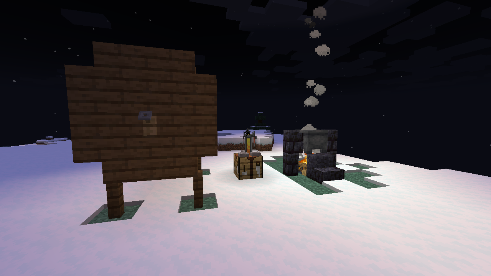
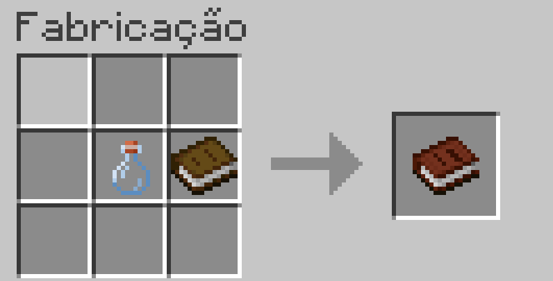
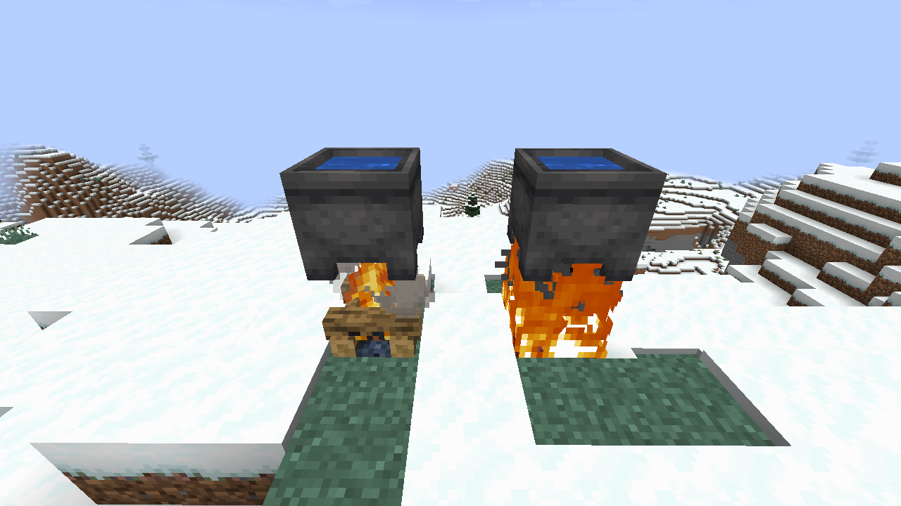
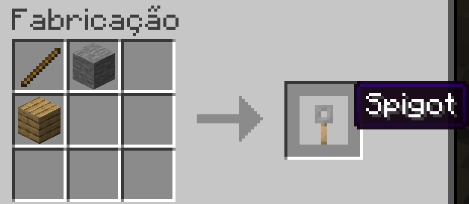
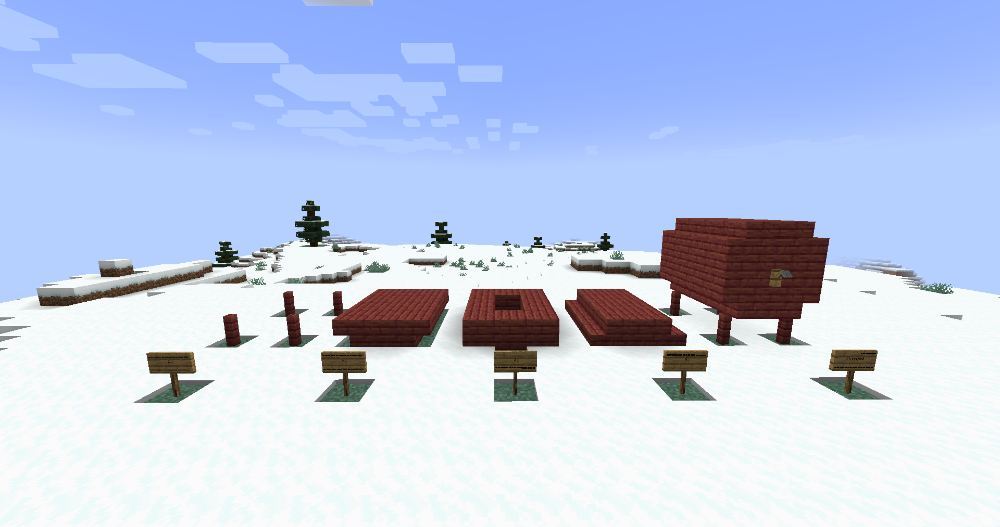

# Mod Cervejaria - Patbox's Brewery

Brewery é um mod que permite criar bebidas alcoólicas e não alcoólicas usando caldeirões e barris. Além de algumas bebidas já inclusas, você pode adicionar qualquer quantidade de bebidas personalizadas com suas próprias receitas e funcionalidades usando datapacks (Solicitar ao admin caso queira fazer alguma adição)

## Primeiros Passos
Você pode conferir todas as receitas ao criar o **Livro da Cervejaria** (1 garrafa de vidro e 1 livro).

### Cozinhando/Fervendo com Caldeirão (Preparando misturas)
Usar o caldeirão é bem simples. Basta jogar os ingredientes no caldeirão cheio de água
colocado sobre uma fogueira (ou campfire) e então clicar nele com um graveto. Isso irá consumir os ingredientes e começar a cozinhar/fervê-los. O tempo passado será exibido acima do caldeirão. Quando atingir o valor desejado, basta clicar com uma garrafa de vidro vazia para obter a mistura ou bebida pronta.

### Criando barril
Os barris da cervejaria são construídos no mundo. Para fazer um, siga os passos abaixo:

1. Separe os materiais necessários (todos do mesmo tipo de madeira):
    - 1 torneira (craftada com pedra, graveto e qualquer tipo de tábua)
    
    - 4 cercas
    - 16 escadas de madeira
    - 20 tábuas de madeira

2. Posicione os itens conforme mostrado na imagem abaixo.
    - A rotação das escadas não importa.
    - Coloque a torneira por último.

### Envelhecendo misturas/bebidas com Barris
A maioria dos tipos de bebida requer envelhecimento com barris. Porém, nem todos os barris são iguais. Algumas bebidas terão qualidade superior em certos tipos de barril, outras não poderão ser feitas.

Para começar a envelhecer uma mistura/bebida, basta clicar em um barril que você fez (não o vanilla!) e colocar seus itens lá. Eles começarão a envelhecer automaticamente. Quando atingirem qualidade suficiente, você pode retirá-los.

## LINKS:
- Modrinth: https://modrinth.com/mod/brewery
- Github: https://github.com/Patbox/brewery/releases

### Datapacks que adicionam novas bebidas que você pode querer conferir.
- Cabbage Substances: https://modrinth.com/datapack/cabbage-substances
- Mainstay Recipe Book: https://modrinth.com/datapack/mainstay-recipe-book
- To the Baikal: https://modrinth.com/datapack/to-the-baikal