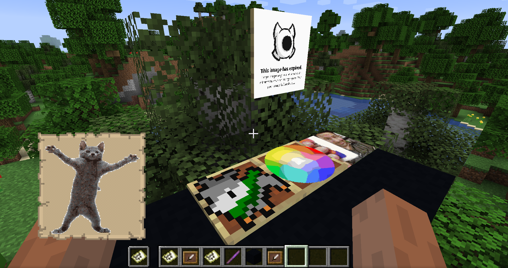
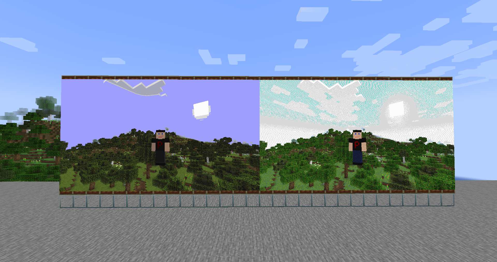

# Image2Map

Um mod que permite renderizar uma imagem em um mapa(s).

## Comandos:
- `/image2map create <LARGURA> <ALTURA> <[dither/none]> <URL>` - Cria um mapa do tamanho especificado (em pixels, um mapa único é 128x128), com ou sem dithering, usando a imagem fornecida
- `/image2map create <[dither/none]> <URL>` - Cria um mapa com ou sem dithering usando a imagem fornecida
- `/image2map preview <URL>` - Cria uma prévia dinâmica antes de salvar o mapa como item

### Comandos no modo de prévia
- `/dither <[dither/none]>` - Altera o modo de dithering
- `/size` - Exibe o tamanho atual
- `/size <LARGURA> <ALTURA>` - Altera o tamanho do mapa para o especificado (em pixels, um mapa único é 128x128)
- `/grid` - Alterna a visibilidade da grade do mapa
- `/save` - Sai da prévia e salva o mapa como itens
- `/exit` - Sai da prévia sem salvar

### O que é dithering?

Dithering é uma técnica que adiciona uma espécie de "ruído" controlado à imagem para suavizar transições de cores e reduzir o efeito de bandas visuais. Isso pode ajudar a representar melhor imagens com paletas de cores limitadas, como as usadas em mapas do Minecraft.

### Multimapas
No caso de mapas maiores que 128x128 pixels, você os receberá em um pacote. Clicar com ele no canto superior esquerdo de molduras de itens irá posicionar todos os mapas nos lugares corretos. Funciona para qualquer moldura de item na parede, chão ou teto.

## LINKS:
- Modrinth: https://modrinth.com/mod/image2map
- GitHub: https://github.com/Patbox/Image2Map
